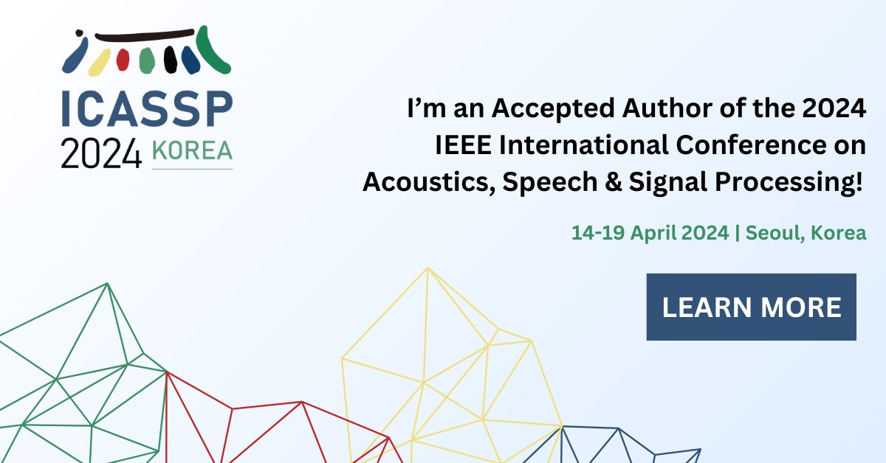

🎉 I am super happy to share that the second paper done during my internship at Microsoft this summer has been accepted to the [2024 IEEE International Conference on Acoustics, Speech & Signal Processing (ICASSP)](https://2024.ieeeicassp.org/)! 

The title is "LEVERAGING TIMESTAMP INFORMATION FOR SERIALIZED JOINT STREAMING
RECOGNITION AND TRANSLATION" and the pre-print is already available at: [https://arxiv.org/pdf/2307.03354.pdf](https://arxiv.org/pdf/2307.03354.pdf).