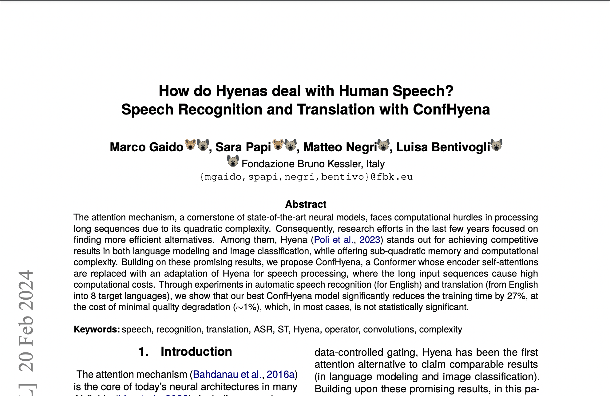

🎉 I am glad to announce that our paper "How do Hyenas deal with Human Speech? Speech Recognition and Translation with ConfHyena", co-authored with Marco Gaido, Matteo Negri, and Luisa Bentivogli from Fondazione Bruno Kessler (FBK), has been accepted at [LREC-COLING 2024](https://lrec-coling-2024.org/)!
 
 Preprint is available on arXiv: [https://arxiv.org/abs/2402.13208](https://arxiv.org/abs/2402.13208)