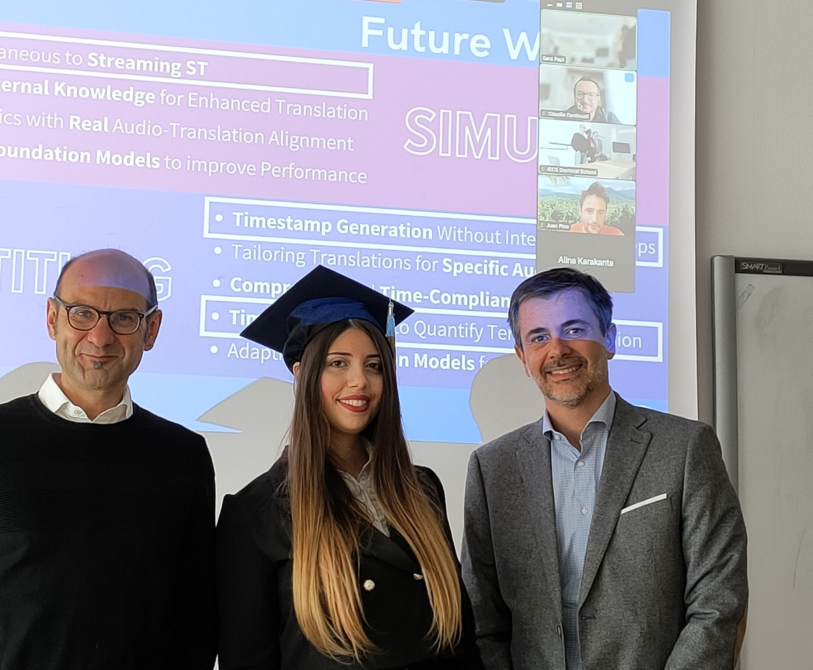

I am very happy to announce that I successfully defended my PhD in Computer Science cum Laude on the topic "Direct Speech Translation in Constrained Contexts: the Simultaneous and Subtitling Scenarios". 

A special thank to my advisors Matteo Negri (FBK) and Marco Turchi (Zoom), the committee members Claudio Fantinuoli (KUDO and University of Mainz), Juan Pino (Meta AI), Jacopo Staiano (University of Trento) and Carlo Strapparava (FBK and University of Trento), and to everyone who was part of my 3-year PhD journey!
